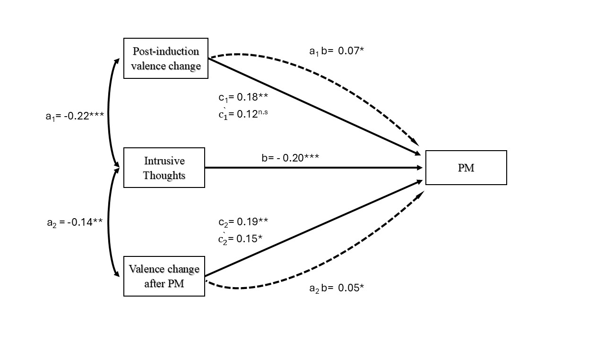

## Valence-PM-thoughts project
Script of the analyses 
"Intrusive Thoughts Mediate the Links Between Affective Valence and Prospective Memory"

```{r}
#| message: false
#| warning: false

rm(list= ls())
source("R/0.get_packages.R")

```

```{r}
#| message: false
#| warning: false
# change some parameters for plotting
params<-
  theme(
    plot.title = element_text(size = 35),
    axis.title.x = element_text(size = 28),
    axis.title.y = element_text(size = 28),
    axis.text=element_text(size=26),
    legend.text=element_text(size=rel(2.5)),
    legend.title = element_text(size=rel(2.5)), 
    strip.text.x = element_text(size=25)
  )

# use colour-blind friendly palette
okabe_ito <- c("YA" = "#0072B2",  # blue
               "OA" = "#D55E00")  # vermillion


# use the labeller
lab_valence <- ggplot2::as_labeller(c(
  post_induction = "Post-induction Change",
  post_task      = "Post-task Change"
))
```


```{r}
#| include: false
#| message: false
#| warning: false


source("helper_functions/extract_rt.R")
# now source the script that extract the data
source("R/1.extract_files.R")

```

## 
Five participants who did not belong to the age range of both YA and OA were excluded
```{r}
#| message: false
#| warning: false
#------------------------------------------------------------------------------#
# Import datasets and exclude participants
#------------------------------------------------------------------------------#
# import the spss dataset
df_wide<-read.csv("group_data/df_wide.csv")

# now we need to add the order of the conditions, i.e. which condition is presented
# first, which one second, and which one third
# there are six conditions, repeated within participants.
# they can be found in the files "Age, Mood and PM Project Participant Code.xlsx
# They are the following

conditions <- matrix(
  c(
    "Positive", "Negative", "Neutral",
    "Positive", "Neutral",  "Negative",
    "Negative", "Positive", "Neutral",
    "Negative", "Neutral",  "Positive",
    "Neutral",  "Negative", "Positive",
    "Neutral",  "Positive", "Negative"
  ),
  
  nrow = 6,
  byrow = TRUE
)

# I need to repeat it 11 times to get all participants
cond_all<-conditions[rep(1:nrow(conditions), 11), ]

# get the order variable
df_wide$order<-NA
for (n in 1:nrow(df_wide)){ # loop through the observations (conditions)
  
  if (df_wide$participant[n]<100){ # if participant number was not modified
    
    c_order<- cond_all[df_wide$participant[n],]
    
    # in which position is that condition for that participant?
    c_num<-which(c_order == df_wide$cond[n])
    
    
  } else { # if we added 100 to the participants (older adults) to distinguish
    # them from the YA
    
    c_order<- cond_all[df_wide$participant[n]-100,]
    
    c_num<-which(c_order == df_wide$cond[n])
    
  }
  
  df_wide$order[n]<-c_num
  
  
  
}

# get the spss file
spss_data<-read.csv("PM final data.csv"  )
#------------------------------------------------------------------------------#

#------------------------------------------------------------------------------#
# create age variable
df_wide$agegroup<-ifelse(df_wide$agegroup==1, "YA", "OA")
#df_long$agegroup<-ifelse(df_long$agegroup==1, "YA", "OA")
spss_data$AgeGroup<-ifelse(spss_data$AgeGroup==1, "YA", "OA")

single_part<- df_wide %>%
  group_by(participant) %>%
  slice(1)

print(paste("Total number of participants is", nrow(single_part)))

# plot the distribution of age as a function of agegroup
spss_data$AgeGroup<-factor(spss_data$AgeGroup, levels = c("YA", "OA"))

# exclude participants who do not belong to the classical age range
age_excl<-spss_data$Nb[(spss_data$Age>35 & spss_data$AgeGroup=="YA") |
                        (spss_data$Age<60 & spss_data$AgeGroup=="OA") ]

# exclude those participants 
spss_data<-spss_data[!spss_data$Nb %in% age_excl,]
df_wide<-df_wide[!df_wide$participant %in% age_excl,]
single_part<-single_part[!single_part$participant %in% age_excl,]
#df_long<-df_long[!df_long$participant %in% age_excl,]


age_plot<-ggplot(spss_data, aes(x = Age))+
  geom_histogram()+
  facet_wrap(.~AgeGroup)+
  theme_classic()

print(age_plot)

# check the number of participants
kable(df_wide %>%
        group_by(participant) %>%
        slice(1) %>%
        group_by( agegroup)%>%
        tally())

#--------------------

```


## Sociodemographics
First, apply exclusion for participants who do not belong to the age range
and get demographics
```{r}
source("R/2.sociodemographics.R")

kable(gender_part, caption = "Gender by Agegroup")

kable(part_demo, caption = "Sociodemographics")

```

## Sociodemographics
Compare the sociodemographics between young and old
```{r}
#| message: false
#| warning: false
#| 
source("R/3.compare_sociodemo.R")

summary(mod_health)

summary(mod_educat)

summary(mill_hill)

summary(digit_symbol)

# create a contingency table to check whther the distribution of gender is equal
contingency_table_gender<-table(single_part[, c("agegroup", "gender")])
chi_square_test <- chisq.test(contingency_table_gender)
chi_square_test

```

Valence reshaped
```{r}
#| message: false
#| warning: false
# now call  the script to the reshape the valence
source("R/4.valence_reshape.R")

# participant check
# check the number of participants
kable(long_df_valence %>%
        group_by(participant) %>%
        slice(1) %>%
        group_by( agegroup)%>%
        tally())

kable(long_df_valence_diff %>%
        group_by(participant) %>%
        slice(1) %>%
        group_by( agegroup)%>%
        tally())


```

Preprocessing of valence. 
Derivation of post-induction and post valence measures and visualization
```{r}
#| message: false
#| warning: false
source("R/5.valence_preproc.R")
```
## Valence analyses
```{r}
#| message: false
#| warning: false

# Group data by Condition, calculate mean and SD
summary_table_valence <-   long_df_valence_split %>%
  group_by(valence_measure, cond, agegroup) %>%
  summarize(
    Mean = mean(valence_value, na.rm = TRUE),
    SD = sd(valence_value, na.rm = TRUE),
    .groups = 'drop'  # To avoid message about grouping
  )


summary_table_valence


# analyze valence
long_df_valence_split$agegroup.c<-ifelse(long_df_valence_split$agegroup=="YA", -0.5, 0.5)

mod_valence<-lmer(valence_value~agegroup*valence_measure*cond +(1|participant), 
                  data = long_df_valence_split)


summary(mod_valence)
tab_model(mod_valence)
anova(mod_valence )

eta_squared(mod_valence, partial=T,alternative = "two.sided" )

emm_mean<-emmeans(mod_valence, ~ valence_measure*agegroup | cond )

# 2) Omnibus tests within each valence_measure (does cond matter? any agxcond interaction?)
joint_tests(emm_mean, by = "valence_measure")


# 3) Pairwise contrasts of cond within each agegroup and measure (your main request)
pairs(emm_mean,
      by     = c( "cond", "valence_measure"),
      adjust = "bonferroni")

# now break down the valence by condition interaction
emm_mean2<-emmeans(mod_valence, ~ cond | valence_measure )

pairs(emm_mean2,
      
      adjust = "bonferroni")

print(emm_mean2)

print(
emmip(mod_valence, agegroup ~ cond | valence_measure, CIs = TRUE) +
  theme_minimal() + labs(y = "Estimated valence", x = "Condition", color = "Age group")+
  # scale_color_manual(values = c(YA = "darkorange", OA = "darkgreen")) +
  scale_color_manual(values = okabe_ito,
                     labels = c(YA = "YA", OA = "OA")) +
  geom_hline(aes(yintercept = 0), color = "black")  +
  
  #scale_fill_manual(values = c(YA = "darkorange", OA = "darkgreen")) +  # CI ribbons
  scale_fill_manual(values = okabe_ito,
                    labels = c(YA = "YA", OA = "OA")) +  # CI ribbons
  
  theme_classic()+params+
  facet_wrap(
    ~ valence_measure,
    labeller = lab_valence
  )
)

emmip(mod_valence, agegroup ~ cond | valence_measure, CIs = TRUE) +
  theme_minimal() + labs(y = "Estimated valence", x = "Condition", color = "Age group")+
  # scale_color_manual(values = c(YA = "darkorange", OA = "darkgreen")) +
  scale_color_manual(values = okabe_ito,
                     labels = c(YA = "YA", OA = "OA")) +
  geom_hline(aes(yintercept = 0), color = "black")  +
  
  #scale_fill_manual(values = c(YA = "darkorange", OA = "darkgreen")) +  # CI ribbons
  scale_fill_manual(values = okabe_ito,
                    labels = c(YA = "YA", OA = "OA")) +  # CI ribbons
  
  theme_classic()+
  facet_wrap(
    ~ valence_measure,
    labeller = lab_valence
  )


source("R/6.valence_analysis.R")
```

## additional arousal analysis
```{r}
#| message: false
#| warning: false
#| include: true
source("R/6S.arousal_analysis.R")

```


## PM analysis
```{r}
#| message: false
#| warning: false
source("helper_functions/logit_transform.R")

source("R/7.PM_main_analysis.R")

# regression with all the control variables
reg.s<-lmer(PM_task_lenient_av_log~order_c*agegroup.c+DS.c+Mill_Hill.c+aft_PM_minus_after_ind.s*agegroup.c + 
              valence_aftIND_min_bef.s*agegroup.c+(1+order_c|participant), 
            data = long_df_merged[ (is.na(long_df_merged$MOCA)|long_df_merged$MOCA>=26),])
summary(reg.s)

tab_model(reg.s, file = "main_regression_table.html")


anova(reg.s)


vif(reg.s)

eta_squared(reg.s, partial = T, alternative = "two.sided")

```
## Spline analysis
```{r}
#------------------------------------------------------------------------------#
# Spline analysis

# now we want to know whether it is positive or negative side that drives the effect
long_df_merged$post_ind_pos_spline<-
  ifelse(long_df_merged$valence_aftIND_min_bef>0,
         long_df_merged$valence_aftIND_min_bef, 0 )

long_df_merged$post_ind_neg_spline<- 
  ifelse(long_df_merged$valence_aftIND_min_bef<0,
         long_df_merged$valence_aftIND_min_bef, 0 )

long_df_merged$post_PM_pos_spline<- 
  ifelse(long_df_merged$aft_PM_minus_after_ind>0,
         long_df_merged$aft_PM_minus_after_ind, 0 )

long_df_merged$post_PM_neg_spline<- 
  ifelse(long_df_merged$aft_PM_minus_after_ind<0,
         long_df_merged$aft_PM_minus_after_ind, 0 )

# scale the predictors
long_df_merged$post_ind_pos_spline.s<-scale(long_df_merged$post_ind_pos_spline)
long_df_merged$post_ind_neg_spline.s<-scale(long_df_merged$post_ind_neg_spline)
long_df_merged$post_PM_pos_spline.s<-scale(long_df_merged$post_PM_pos_spline)
long_df_merged$post_PM_neg_spline.s<-scale(long_df_merged$post_PM_neg_spline)

mod_splines<-lmer(PM_task_lenient_av_log~
                    agegroup.c*order_c+DS.c+Mill_Hill.c+
                    post_ind_pos_spline+post_ind_neg_spline+
                    + agegroup.c+
                    post_PM_pos_spline+post_PM_neg_spline+
                    (1|participant), 
                  data = long_df_merged[ (is.na(long_df_merged$MOCA)|
                                            long_df_merged$MOCA>=26) ,],
                  control =  lmerControl(optimizer = "bobyqa",
                                         optCtrl = list(maxfun = 100000)))

tab_model(mod_splines)

vif(mod_splines)


mod_splines.s<-lmer(PM_task_lenient_av_log~
                      agegroup.c*order_c+DS.c+Mill_Hill.c+
                      
                    post_ind_pos_spline.s+post_ind_neg_spline.s+
                    + agegroup.c+
                    post_PM_pos_spline.s+post_PM_neg_spline.s+
                    (1|participant), 
                  data = long_df_merged[ (is.na(long_df_merged$MOCA)|
                                            long_df_merged$MOCA>=26) ,],
                  control =  lmerControl(optimizer = "bobyqa", optCtrl =
                                           list(maxfun = 100000)))

print(summary(mod_splines.s))
tab_model(mod_splines.s)

vif(mod_splines)
```

## Supplementary analyses
```{r}
source("R/8.supplementary_analyses.R")
```

## Intrusive thoughts
```{r}
#| message: false
#| warning: false

#------------------------------------------------------------------------------#
# Effect of general intrusive thoughts on PM
#------------------------------------------------------------------------------#
mod_thouhgts_gen_PM<-lmer(PM_task_lenient_av_log~
                            DS.c+Mill_Hill.c+order_c+
                            tcaq_g*agegroup.c+c_tcaq*agegroup.c+
                            (1|participant), 
                          long_df_merged[ (is.na(long_df_merged$MOCA)|long_df_merged$MOCA>=26) ,])

tab_model(mod_thouhgts_gen_PM)
print(
summary(mod_thouhgts_gen_PM)
)
anova(mod_thouhgts_gen_PM)

eta_squared(mod_thouhgts_gen_PM, partial = T, altenative = "two.sided")

# run analysis for yound and older separately
mod_thoughts_PM_YA<-lmer(PM_task_lenient_av_log~tcaq_g+
                           DS.c+Mill_Hill.c+order_c+(1|participant), 
                         long_df_merged[ (is.na(long_df_merged$MOCA)|long_df_merged$MOCA>=26) &
                                           long_df_merged$agegroup=="YA",])

res_YA<-anova(mod_thoughts_PM_YA)

# correct the pvalue
p_corr_YA<-res_YA$`Pr(>F)`*2
p_corr_YA

eta_squared(mod_thoughts_PM_YA, partial = T, altenative = "two.sided")
# now older
mod_thoughts_PM_OA<-lmer(PM_task_lenient_av_log~tcaq_g+
                            DS.c+Mill_Hill.c+order_c+(1|participant), 
                         long_df_merged[ (is.na(long_df_merged$MOCA)|long_df_merged$MOCA>=26) &
                                           long_df_merged$agegroup=="OA",])

res_OA<-anova(mod_thoughts_PM_OA)
p_corr_OA<-res_OA$`Pr(>F)`*2
p_corr_OA

eta_squared(mod_thoughts_PM_OA, partial = T, altenative = "two.sided")

tab_model(mod_thoughts_PM_OA)

# additional analyses
source("R/9.intrusive_thoughts.R")
```

## Associational variable analyses
```{r}
#| warning: false

library(parameters)

# valence after the induction on pm, without considering intrusive thoughts
valence_PM<-lmer(PM_task_lenient_av_log~  
                   valence_aftIND_min_bef.s+
                   aft_PM_minus_after_ind.s + 
                   DS.c+Mill_Hill.c+order_c+
                   (1+order_c|participant), 
                 data = long_df_merged[ (is.na(long_df_merged$MOCA)|long_df_merged$MOCA>=26),])

summary(valence_PM)

anova(valence_PM)

standardize_parameters(valence_PM)

# association between thoughts and valence
mod_thouhgts_task_paths<-lmer(c_tcaq~+aft_PM_minus_after_ind.s+
                                valence_aftIND_min_bef.s+
                                DS.c+Mill_Hill.c+agegroup.c+order_c+
                          (1+order_c|participant), 
                        long_df_merged[ (is.na(long_df_merged$MOCA)|long_df_merged$MOCA>=26) ,])

summary(mod_thouhgts_task_paths)
standardize_parameters(mod_thouhgts_task_paths)


# now thought alone
PM_thoughts<-lmer(PM_task_lenient_av_log~  
                            DS.c+Mill_Hill.c+order_c+ 
                            c_tcaq+
                            (1+order_c|participant), 
                          data = long_df_merged[ (is.na(long_df_merged$MOCA)|long_df_merged$MOCA>=26),])

summary(PM_thoughts)
anova(PM_thoughts)
standardize_parameters(PM_thoughts)


standardize_parameters(PM_thoughts)


long_df_merged$valence_aftIND_agegroup<-long_df_merged$valence_aftIND_min_bef.s*long_df_merged$agegroup.c
long_df_merged$valence_aftPM_agegroup<-long_df_merged$aft_PM_minus_after_ind.s*long_df_merged$agegroup.c

associational_variable_analysis <- paste( '
  level: 1
    PM_task_lenient_av_log ~ c*valence_aftIND_min_bef.s + DS.c+Mill_Hill.c+agegroup.c+order_c+valence_aftIND_agegroup+valence_aftPM_agegroup
    PM_task_lenient_av_log ~ c2*aft_PM_minus_after_ind.s+DS.c+Mill_Hill.c+agegroup.c+order_c+valence_aftIND_agegroup+valence_aftPM_agegroup
    c_tcaq ~ a*valence_aftIND_min_bef.s+DS.c+Mill_Hill.c+agegroup.c+order_c+valence_aftIND_agegroup
   c_tcaq ~ a2*aft_PM_minus_after_ind.s+DS.c+Mill_Hill.c+agegroup.c+order_c+valence_aftPM_agegroup

    PM_task_lenient_av_log ~ b*c_tcaq +DS.c+Mill_Hill.c+agegroup.c+order_c

  level: 2   # random intercepts only
    # estimate the variance at level two 
    PM_task_lenient_av_log ~~ PM_task_lenient_av_log
    c_tcaq~~ c_tcaq
      #valence_aft_ind ~~ valence_aft_ind

    # (optional) valence_aft_ind ~~ c_tcaq + PM_task_lenient_av
    # (optional) aft_PM_minus_after_ind ~~ c_tcaq + PM_task_lenient_av

  # within-level indirects and totals
    a2b := a2*b; 
    ab := a*b;

  total_valence := c + ab 
  total_valence2 := c2 + a2b 


'
)

fit_assoc_path <- sem(model = associational_variable_analysis,
                     data = long_df_merged[ (is.na(long_df_merged$MOCA)|long_df_merged$MOCA>=26) ,], cluster = "participant",
                     estimator = "MLR",
                     missing = "ML")

print(
  summary(fit_assoc_path, std=T, fit.measures = T)
)

#------------------------------------------------------------------------------#

```

## Create a correlation table with all the variables
```{r}
df_for_corr <- long_df_merged %>%

group_by(participant) %>%
summarise(
agegroup = first(agegroup),
education_y = first(education_y),
health = first(health),
fluid_intelligence = first(DS), 
crystallized_intelligence = first(Mill_Hill),
general_intrusive_thoughts = first(tcaq_g),
task_related_intrusive_thoughts = mean(c_tcaq, na.rm = T),
PM_performance = mean(PM_task_lenient_av, na.rm = T),
#baseline_valence = first(baseline_valence),
post_induction_valence_change = mean(valence_aftIND_min_bef, na.rm = TRUE),
post_task_valence_change = mean(aft_PM_minus_after_ind, na.rm = TRUE),
)

str(df_for_corr)

# confert age group to numeric
df_for_corr$agegroup<-ifelse(df_for_corr$agegroup=="YA", -0.5, 0.5)
cor_tbl<-corr.test(df_for_corr[, 2:ncol(df_for_corr)], use = "pairwise", method = "pearson", adjust = "none")

corr_table <- round(cor_tbl$r, 2)
p_table <- round(cor_tbl$p, 4)

sink("correlation_table.txt")
cat("Correlation matrix\n")
print(round(cor_tbl$r, 2))

cat("\nP-value matrix\n")
print(round(cor_tbl$p, 4))
sink()

```
## 

